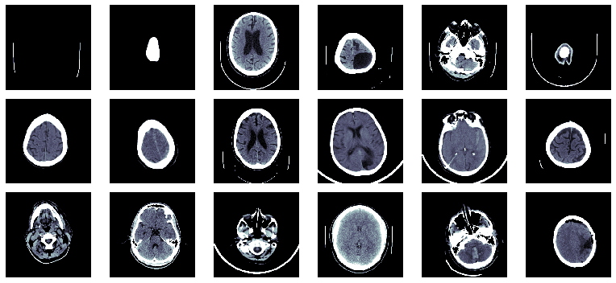

# Kaggle: RSNA Intracranial Hemorrhage Detection ([link](https://www.kaggle.com/c/rsna-intracranial-hemorrhage-detection/overview))

__Data__: 671 797 CT scans of brains

__Task__: predict whether a hemorrhage exists in a given image, and what type it is

__Evaluation__: Weighted Multi-label Logarithmic Loss

__Solution__: 2D-CNN with EfficientNetB0 base

__Success__: 0.089 Weighted Mean Column-wise Log Loss

